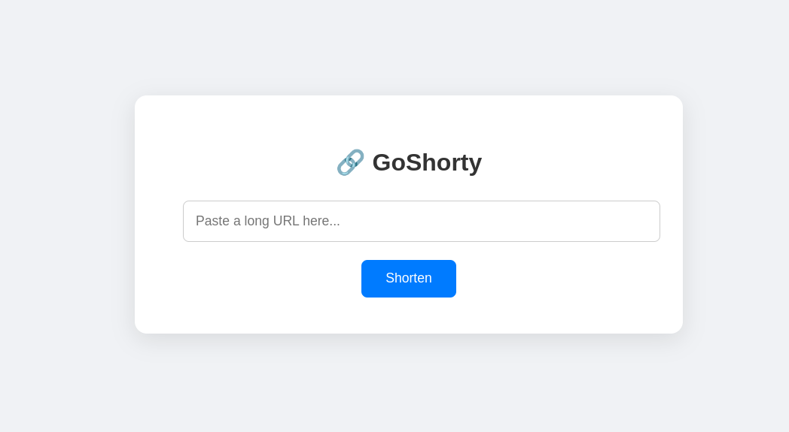

## GoShorty: Go URL Shortener


A Simple URL shortener built with Go, designed to shorten long URLs and redirect to the original URL using a custom short code

### ✨ Features
- 🔗 **Shorten URLs**: Enter a long URL and get a shortened version.
- 🚀 **Redirect to Original URL**: Use the shortened URL to be redirected to the original destination.
- 🌐 **Dynamic Base URL**: Automatically detects the environment (localhost or production) and builds the correct base URL.
- ⏰ **Expiration Support**: Shortened URLs automatically expire after 7 days and return a proper error message when expired.

### ✅ Prequisites
Make sure you have the following installed:

- [Go](https://go.dev/dl/) (latest version preferred)
- Git

### 🚀 Installation 
1. Clone the repository:
```
git clone https://github.com/ariestaazalia/goshorty.git
cd goshorty
```
2. Run the project:
```
go run main.go
```